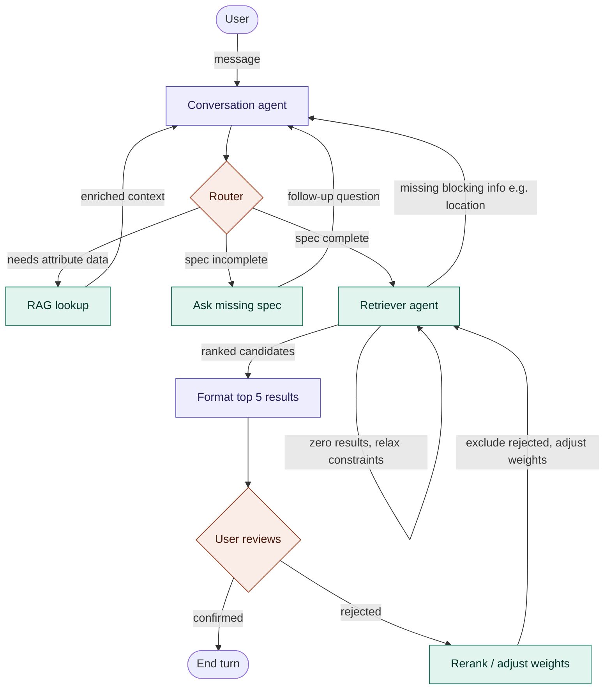

# flow



Legend: purple = LLM call, teal = deterministic logic, coral = routing/gate (no computation, just a branch decision). This maps directly to the node table from the previous answer — only `Conversation agent` and `Format top 5 results` are actual model calls; everything else is plain control flow, which is what makes the reject → rerank → retriever loop and the zero-result self-loop on `Retriever agent` safe to unit test without touching a prompt.

## Shared state schema

Every node reads/writes this. Defining it first makes each node's contract explicit.

```python
from typing import TypedDict, Annotated, Literal
from langgraph.graph.message import add_messages

class ProductSpec(BaseModel):
    category: str | None = None
    price_min: float | None = None
    price_max: float | None = None
    required_attributes: dict[str, str] = {}
    is_complete: bool = False

class Candidate(BaseModel):
    product_id: str
    supplier_id: str
    similarity_score: float
    quality_score: float
    distance_km: float
    price: float

class InventoryState(TypedDict):
    messages: Annotated[list, add_messages]
    spec: ProductSpec
    customer_location: tuple[float, float]
    candidates: list[Candidate]
    ranked_results: list[Candidate]
    rejected_ids: list[str]           # accumulates across re-rank cycles
    rank_weights: dict[str, float]    # adjustable per rejection
    missing_fields: list[str]
    turn_status: Literal["ask", "retrieve", "confirm", "done"]
```

---

## 1. Conversation agent

**Purpose:** Turn free-text customer input into structured spec fields. This is your only node where ambiguity resolution genuinely needs an LLM.

**Trigger:** Entry point after a new user message, or re-entry from `ask_missing_spec` / `rag_lookup`.

**Logic:**

```python
def conversation_node(state: InventoryState) -> InventoryState:
    llm = ChatOpenAI(model="gpt-4o").with_structured_output(ProductSpec)
    result = llm.invoke([
        SystemMessage(content=CONVERSATION_SYSTEM_PROMPT),
        *state["messages"],
    ])
    # merge, don't overwrite — customer may fill fields across turns
    merged_spec = merge_spec(state["spec"], result)
    return {"spec": merged_spec, "messages": [AIMessage(content=result.clarifying_question or "")]}
```

**Key design point:** don't let the LLM decide "am I done" conversationally — it should emit structured fields every turn, and a separate deterministic check (`spec_validator`, folded into the router) decides completeness. Keeps behavior reproducible.

**Edge cases:** contradictory info across turns (customer says "under $500" then "$800 is fine") — merge logic should prefer the latest value per field, not concatenate; off-topic input — this node should redirect, not attempt to force-fit into a spec field.

---

## 2. Router (conditional edge, not an LLM node)

**Purpose:** Deterministic dispatcher — the piece your original diagram was missing. Pure Python, no LLM call, sub-millisecond.

```python
def route_after_conversation(state: InventoryState) -> Literal["rag_lookup", "ask_missing_spec", "retriever"]:
    if state["spec"].needs_attribute_lookup:   # e.g. customer asked "what colors do you have?"
        return "rag_lookup"
    if not state["spec"].is_complete:
        return "ask_missing_spec"
    return "retriever"

graph.add_conditional_edges("conversation_agent", route_after_conversation, {
    "rag_lookup": "rag_lookup",
    "ask_missing_spec": "ask_missing_spec",
    "retriever": "retriever_agent",
})
```

**Why it matters:** this is the fix for the fan-out ambiguity in your original diagram — exactly one branch fires per turn, and the branching logic lives in one place you can unit-test independently of any LLM call.

---

## 3. RAG lookup

**Purpose:** Ground the conversation agent's next question in what's actually purchasable — not a general product search, a narrow attribute lookup.

```python
def rag_lookup_node(state: InventoryState) -> InventoryState:
    category = state["spec"].category
    attrs = db.query(
        "SELECT DISTINCT attribute_name, attribute_value FROM ProductAttributes "
        "WHERE category = ?", category
    )
    return {"messages": [SystemMessage(content=f"Available attributes for {category}: {attrs}")]}
```

**Contract:** always returns to `conversation_agent` (closing the dead end from your original draft) — it never talks to the customer directly, it only enriches context for the next conversation turn.

**Production note:** cache per-category attribute lists (they change rarely) rather than hitting SQL Server on every ambiguous-attribute question.

---

## 4. Ask missing spec

**Purpose:** Formats a targeted follow-up question for whichever fields are still null — separate from the general conversation node so the "what am I still missing" logic is inspectable/testable independent of the LLM's free-form chat behavior.

```python
def ask_missing_spec_node(state: InventoryState) -> InventoryState:
    missing = [f for f in REQUIRED_FIELDS if getattr(state["spec"], f) is None]
    question = format_followup_question(missing)  # template-based, not LLM
    return {"messages": [AIMessage(content=question)], "missing_fields": missing}
```

**Why template-based, not LLM:** you already know exactly which fields are missing — generating the question deterministically (or with a very constrained LLM call) is cheaper and more predictable than asking a model to re-derive what's missing from conversation history.

**Returns to:** `conversation_agent` for the next customer turn (closes the second dead end).

---

## 5. Retriever agent

**Purpose:** The hybrid filter-then-rank pipeline from our earlier discussion — SQL Server structured filter, then in-memory cosine similarity, then blended scoring. Internally this is 2-3 deterministic sub-steps, not a single LLM call.

```python
def retriever_node(state: InventoryState) -> InventoryState:
    spec, loc = state["spec"], state["customer_location"]

    # 1. SQL Server structured filter
    candidates = db.query("""
        SELECT p.*, s.Location.STDistance(?) AS distance,
               sq.quality_score
        FROM Products p
        JOIN Suppliers s ON p.SupplierId = s.Id
        JOIN SupplierQualityScores sq ON s.Id = sq.SupplierId
        WHERE p.Category = ? AND p.Price BETWEEN ? AND ?
          AND s.Location.STDistance(?) <= ?
          AND p.ProductId NOT IN ({rejected_ids})
        ORDER BY distance
    """, loc, spec.category, spec.price_min, spec.price_max, loc, spec.max_radius)

    if not candidates:
        return {"turn_status": "ask", "messages": [AIMessage(content=RELAXATION_PROMPT)]}

    # 2. In-memory vector rank against query embedding
    query_vec = embed(spec.to_query_text())
    for c in candidates:
        c.similarity_score = cosine_similarity(query_vec, c.embedding)

    # 3. Blended scoring — uses adjustable weights for re-rank cycles
    w = state["rank_weights"]
    ranked = sorted(candidates, key=lambda c: (
        w["sim"] * c.similarity_score +
        w["quality"] * c.quality_score +
        w["distance"] * (1 - normalize(c.distance))
    ), reverse=True)[:5]

    return {"ranked_results": ranked, "turn_status": "confirm"}
```

**Missing-info branch:** if the structured filter alone can't run (e.g., customer location unavailable), this node routes back to the user asking for that specific field — this is the "missing info" edge from your original diagram, now scoped to genuinely retrieval-blocking gaps rather than conversation-spec gaps (those are handled upstream by the router).

**Zero-result branch:** rather than silently failing, widen constraints in priority order and re-query, explicitly telling the customer what was relaxed — this is the fallback path we identified as missing earlier.

---

## 6. Top 5 results (formatter)

**Purpose:** The one place an LLM adds value on the output side — turning ranked structured data into a customer-facing explanation. Deliberately thin.

```python
def format_results_node(state: InventoryState) -> InventoryState:
    llm = ChatOpenAI(model="gpt-4o-mini")  # cheap model — this is templating, not reasoning
    text = llm.invoke([
        SystemMessage(content="Explain these 5 ranked results briefly, one line each, why they match."),
        HumanMessage(content=json.dumps(state["ranked_results"]))
    ])
    return {"messages": [AIMessage(content=text.content)], "turn_status": "confirm"}
```

**Note:** never let this node touch the ranking numbers themselves — it explains, it doesn't recompute.

---

## 7. User reviews (confirm/reject)

**Purpose:** This is a `langgraph.interrupt()` point, not a real compute node — the graph pauses here for external input.

```python
def review_gate(state: InventoryState) -> Literal["done", "rerank"]:
    response = interrupt({"results": state["ranked_results"]})  # pauses, waits for next invoke
    if response["action"] == "reject":
        return "rerank"
    return "done"
```

**Reject branch (closes the missing feedback loop):**

```python
def rerank_node(state: InventoryState) -> InventoryState:
    rejected = state["rejected_ids"] + [c.product_id for c in state["ranked_results"]]
    adjusted_weights = adjust_weights(state["rank_weights"], state["messages"][-1])
    # e.g. "too expensive" -> lower w['sim'], raise implicit price weight in the SQL filter
    return {"rejected_ids": rejected, "rank_weights": adjusted_weights}
```

Routes back into `retriever_agent`, excluding previously rejected candidates via the `NOT IN` clause above — so the customer never sees the same 5 twice.

---

## Node responsibility summary

| Node | LLM call? | Deterministic? | Loops back to |
| --- | --- | --- | --- |
| Conversation agent | Yes | — | Router |
| Router | No | Yes | (dispatch only) |
| RAG lookup | No | Yes | Conversation agent |
| Ask missing spec | No (templated) | Yes | Conversation agent |
| Retriever agent | No | Yes | Format results, or back to user if blocked |
| Format results | Yes (cheap model) | — | Review gate |
| Review gate | — | Yes (interrupt) | Retriever (on reject) or END |

The pattern worth internalizing: only 2 of 7 nodes are actual LLM calls. Everything else is deterministic pipeline logic wearing "agent" language — which is exactly what makes the rejection/re-rank loop and the zero-result fallback debuggable without touching a prompt.