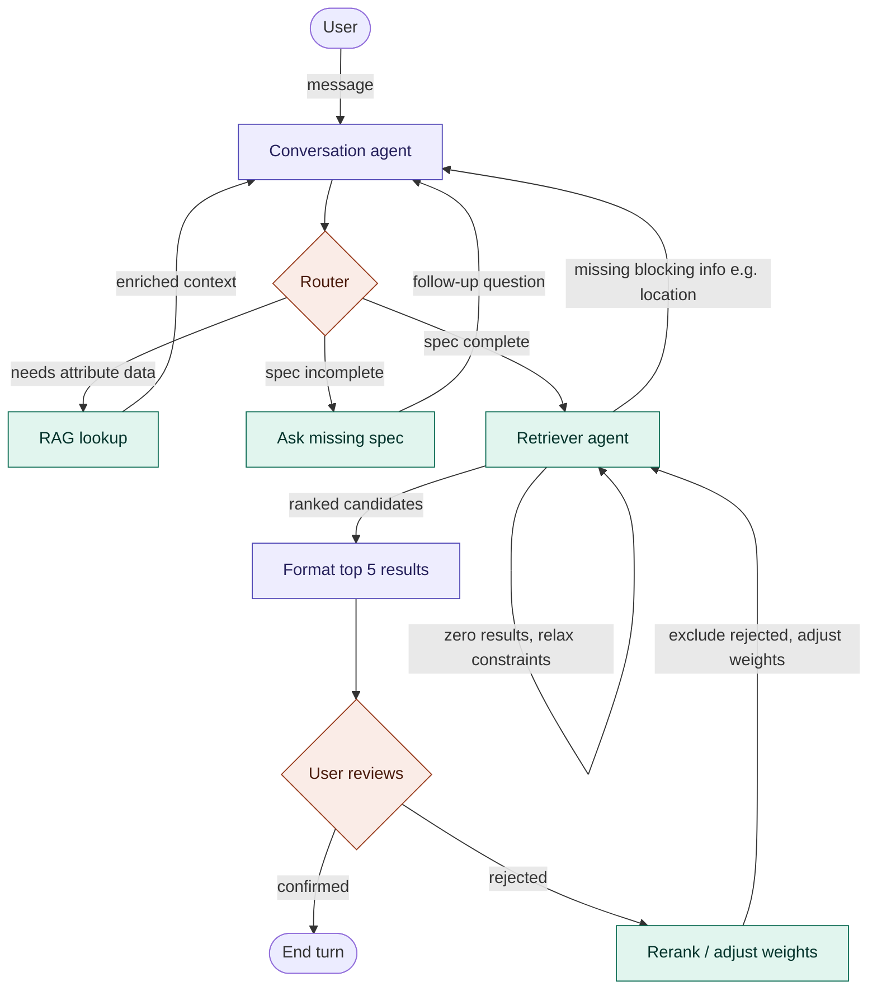

## Architecture — Multi-Agent Inventory Supplier-Matching System

## 1. Overview

This system matches a customer's natural-language product request to the
top 5 available products/suppliers in inventory, optimizing for cost
efficiency, supplier quality, and proximity to the customer. A LangGraph
multi-agent pipeline handles conversation, product-attribute grounding via
RAG, and ranked retrieval, exposed through a FastAPI backend.

**Design principle:** only two nodes in the graph are actual LLM calls.
Everything else — routing, filtering, ranking, quality scoring — is
deterministic pipeline logic. This keeps the majority of the system
unit-testable without mocking a model, and makes ranking decisions
reproducible and debuggable.

## 2. Tech stack

| Layer                 | Choice                                                                                                                                            |
| --------------------- | ------------------------------------------------------------------------------------------------------------------------------------------------- |
| API                   | FastAPI (async)                                                                                                                                   |
| Agent orchestration   | LangGraph (`StateGraph`), LangChain for LLM calls                                                                                                 |
| Database              | SQL Server, async SQLAlchemy 2.0, Alembic migrations                                                                                              |
| Cache / session state | Redis — LangGraph checkpointer + attribute/embedding cache                                                                                        |
| Geospatial            | SQL Server native `geography` type + spatial index (no PostGIS needed)                                                                            |
| Vector similarity     | In-memory cosine similarity (numpy) over a SQL-filtered candidate set — no dedicated vector DB at current scale (thousands of products/suppliers) |
| Testing               | pytest, pytest-asyncio, Locust (load)                                                                                                             |

## 3. Agent graph



### 3.1 Node responsibilities

| Node                   | Type                            | Responsibility                                                                                                          | Returns to                                       |
| ---------------------- | ------------------------------- | ----------------------------------------------------------------------------------------------------------------------- | ------------------------------------------------ |
| **Conversation agent** | LLM (structured output)         | Extracts/merges `ProductSpec` fields from customer messages. Never self-decides completeness.                           | Router                                           |
| **Router**             | Deterministic conditional edge  | Picks exactly one branch per turn: RAG lookup, ask missing spec, or retriever. No LLM call, no fan-out.                 | —                                                |
| **RAG lookup**         | Deterministic, Redis-cached     | Queries distinct attribute values for the identified category so follow-up questions are grounded in real catalog data. | Conversation agent                               |
| **Ask missing spec**   | Deterministic/templated         | Formats a targeted follow-up for whichever required fields are still null.                                              | Conversation agent                               |
| **Retriever agent**    | Deterministic, 3-stage pipeline | SQL structured filter → zero-result relaxation if needed → in-memory cosine similarity + blended ranking.               | Format results, or Conversation agent if blocked |
| **Format results**     | LLM (cheap model)               | Produces a short, human-readable explanation of the top 5. Never recomputes scores.                                     | Review gate                                      |
| **Review gate**        | `interrupt()`                   | Pauses the graph for customer confirm/reject input.                                                                     | End, or Rerank                                   |
| **Rerank**             | Deterministic                   | Excludes rejected IDs, adjusts `rank_weights` based on rejection reason, re-invokes retriever.                          | Retriever agent                                  |

### 3.2 Shared state schema

```python
class ProductSpec(BaseModel):
    category: str | None = None
    price_min: float | None = None
    price_max: float | None = None
    required_attributes: dict[str, str] = {}
    is_complete: bool = False
    needs_attribute_lookup: bool = False

class Candidate(BaseModel):
    product_id: str
    supplier_id: str
    similarity_score: float
    quality_score: float
    distance_km: float
    price: float

class InventoryState(TypedDict):
    messages: Annotated[list, add_messages]
    spec: ProductSpec
    customer_location: tuple[float, float] | None
    candidates: list[Candidate]
    ranked_results: list[Candidate]
    rejected_ids: list[str]
    rank_weights: dict[str, float]
    missing_fields: list[str]
    turn_status: Literal["ask", "retrieve", "confirm", "done"]
```

Sessions are keyed by `thread_id` in the LangGraph checkpointer, which
**must** be Redis- or Postgres-backed (never `MemorySaver`) so that any
stateless app replica can resume any customer's conversation — this is the
mechanism that makes horizontal scaling possible.

## 4. Data layer

- **Source of truth**: SQL Server. No separate vector database is used —
  candidate volume (thousands of products x suppliers) is filtered
  structurally in SQL first (category, price, geo radius via
  `geography.STDistance()`, quality threshold), which typically narrows to
  tens/low-hundreds of rows before any vector math runs. Cosine similarity
  on that narrowed set runs in application memory. Revisit this decision
  only if pre-filter candidate volume grows past roughly 50k–100k.
- **Supplier quality score**: computed by a scheduled **batch job**, never
  in the request path. Uses a Bayesian/shrinkage average for review ratings
  (so a supplier with 3 five-star reviews doesn't outrank one with 500
  reviews at 4.7), blended with on-time-delivery rate and defect/return
  rate.
- **Product embeddings**: precomputed on write (background task on
  create/update), never generated at query time except for the customer's
  live query text.
- **Geospatial**: supplier location stored as a `geography` column with a
  spatial index; distance computed natively via `STDistance()`.

## 5. Scalability (target: thousands of concurrent users)

- Stateless FastAPI instances behind a load balancer; all session state
  lives in the external LangGraph checkpointer.
- Async I/O throughout — SQLAlchemy async engine with explicitly tuned
  `pool_size`/`max_overflow`, async LLM calls, no blocking calls in any node.
- Redis caching for category-attribute lookups and repeated embedding
  lookups, with explicit TTLs.
- Per-user token-bucket rate limiting on `/chat`, returning 429 rather than
  queuing unbounded requests.
- Timeouts and circuit breaking around every external call (LLM, DB).
- Structured JSON logging with `session_id`/`request_id` on every line;
  LangSmith tracing togglable via env var.
- Load-tested via Locust against 1,000 concurrent multi-turn sessions, with
  p95/p99 latency and error rate documented in the repo README.

## 6. Folder structure

```
inventory-multiagent/
├── app/
│   ├── main.py
│   ├── api/
│   │   ├── v1/
│   │   │   ├── chat.py
│   │   │   └── health.py
│   │   └── deps.py
│   ├── core/
│   │   ├── config.py
│   │   ├── logging.py
│   │   └── rate_limit.py
│   ├── agents/
│   │   ├── graph.py
│   │   ├── state.py
│   │   ├── checkpointer.py
│   │   ├── nodes/
│   │   │   ├── conversation.py
│   │   │   ├── router.py
│   │   │   ├── rag_lookup.py
│   │   │   ├── ask_missing_spec.py
│   │   │   ├── retriever.py
│   │   │   ├── format_results.py
│   │   │   └── rerank.py
│   │   └── prompts/
│   │       ├── conversation_system.py
│   │       └── format_results_system.py
│   ├── services/
│   │   ├── embedding_service.py
│   │   ├── ranking_service.py
│   │   └── quality_score_job.py
│   ├── repositories/
│   │   ├── base.py
│   │   ├── product_repository.py
│   │   └── supplier_repository.py
│   ├── db/
│   │   ├── session.py
│   │   ├── models.py
│   │   └── migrations/
│   ├── schemas/
│   │   ├── chat.py
│   │   └── product.py
│   └── worker/
│       └── quality_score_scheduler.py
├── tests/
│   ├── unit/
│   ├── integration/
│   └── load/
├── infra/
│   └── docker/
│       ├── Dockerfile
│       └── docker-compose.yml
├── alembic.ini
├── pyproject.toml
├── .env.example
└── README.md
```

## 7. Delivery plan

The system is built in 6 sprints, each independently verifiable:

1. **Foundation** — scaffolding, DB models/migrations, docker-compose, health check.
2. **Conversation + router** — spec elicitation loop with a working externalized checkpointer.
3. **RAG grounding** — attribute lookups, embedding precompute pipeline.
4. **Retriever + ranking** — structured filter, zero-result relaxation, blended scoring.
5. **Quality scoring + review/rerank** — batch job, confirm/reject loop.
6. **Hardening** — rate limiting, observability, cross-replica session resume, 1,000-concurrent-user load test.

See `inventory_multiagent_sprint_plan.md` for the full per-sprint build
prompts and acceptance criteria.

## 8. Explicit non-goals

- No frontend/UI — backend service only.
- No payment or order-placement flow — the system produces ranked
  recommendations, not transactions.
- No multi-language support unless separately scoped.
