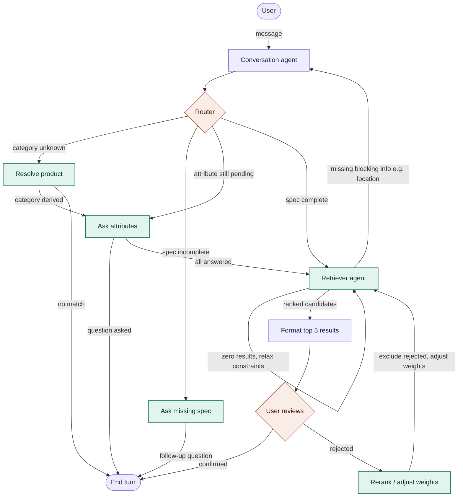

# Architecture — Multi-Agent Inventory Supplier-Matching System

## 1. Overview

This system matches a customer's natural-language product request to the
top 5 available products/suppliers in inventory, optimizing for cost
efficiency, supplier quality, and proximity to the customer. A LangGraph
multi-agent pipeline handles conversation, product-attribute grounding via
RAG, and ranked retrieval, exposed through a FastAPI backend.

**Design principle:** only two nodes in the graph are actual LLM calls.
Everything else — routing, filtering, ranking, quality scoring — is
deterministic pipeline logic. This keeps the majority of the system
unit-testable without mocking a model, and makes ranking decisions
reproducible and debuggable.

## 2. Tech stack

| Layer                 | Choice                                                                                                                                             |
| --------------------- | -------------------------------------------------------------------------------------------------------------------------------------------------- |
| API                   | FastAPI (async)                                                                                                                                    |
| Agent orchestration   | LangGraph (`StateGraph`), LangChain for LLM calls                                                                                                  |
| Database              | None — the backend (.NET) is the source of truth; the AI service holds a Qdrant snapshot only                                                      |
| Cache / session state | Redis — LangGraph checkpointer + attribute-lookup cache                                                                                            |
| Vector store          | Qdrant (self-hosted via Docker) — single query does vector search plus payload filtering (category, price, geo-radius, quality score)              |
| Testing               | pytest, pytest-asyncio, Locust (load)                                                                                                              |

## 3. Agent graph



### 3.1 Node responsibilities

| Node                   | Type                                | Responsibility                                                                                                                                              | Returns to                                       |
| ---------------------- | ----------------------------------- | ----------------------------------------------------------------------------------------------------------------------------------------------------------- | ------------------------------------------------ |
| **Conversation agent** | LLM (structured output)             | Extracts/merges `ProductSpec` fields from customer messages. Never self-decides completeness.                                                               | Router                                           |
| **Router**             | Deterministic conditional edge      | Picks exactly one branch per turn: resolve product, ask missing spec, or retriever. No LLM call, no fan-out.                                               | —                                                |
| **Resolve product**    | Deterministic, Redis-cached         | Semantic lookup of the product name → derives canonical `category` from the top hit, writes `resolved_candidates`.                                            | Ask attributes, or END on a miss                 |
| **Ask attributes**     | Deterministic, sequential            | Asks the customer about every varying attribute (most-varied first), one per turn, via `attribute_prompt`; re-entered while `pending_attributes` is non-empty. | END (pauses for user input), or Retriever        |
| **Ask missing spec**   | Deterministic/templated             | Formats a targeted follow-up for whichever required fields are still null.                                                                                  | END (pauses for user input)                      |
| **Retriever agent**    | Deterministic, multi-stage pipeline | Embeds query → Qdrant vector + payload search (category/price/geo/quality/attribute) → zero-result relaxation if needed → blends returned scores with `rank_weights`. | Format results, or Conversation agent if blocked |
| **Format results**     | LLM (cheap model)                   | Produces a short, human-readable explanation of the top 5. Never recomputes scores.                                                                         | Review gate                                      |
| **Review gate**        | `interrupt()`                       | Pauses the graph for customer confirm/reject input.                                                                                                         | End, or Rerank                                   |
| **Rerank**             | Deterministic                       | Excludes rejected IDs, adjusts `rank_weights` based on rejection reason, re-invokes retriever.                                                              | Retriever agent                                  |

### 3.2 Shared state schema

```python
class ProductSpec(BaseModel):
    category: str | None = None
    price_min: float | None = None
    price_max: float | None = None
    required_attributes: dict[str, str] = {}
    is_complete: bool = False
    needs_attribute_lookup: bool = False

class Candidate(BaseModel):
    product_id: str
    supplier_id: str
    similarity_score: float
    quality_score: float
    distance_km: float
    price: float

class InventoryState(TypedDict):
    messages: Annotated[list, add_messages]
    spec: ProductSpec
    customer_location: tuple[float, float] | None
    candidates: list[Candidate]
    ranked_results: list[Candidate]
    rejected_ids: list[str]
    rank_weights: dict[str, float]
    missing_fields: list[str]
    turn_status: Literal["ask", "retrieve", "confirm", "done"]
```

Sessions are keyed by `thread_id` in the LangGraph checkpointer, which
**must** be Redis- or Postgres-backed (never `MemorySaver`) so that any
stateless app replica can resume any customer's conversation — this is the
mechanism that makes horizontal scaling possible.

## 4. Data layer

- **Source of truth**: the backend (.NET, `../backend-dotnet`) owns all
  product, supplier, and quality data. The AI service persists nothing; it
  keeps a searchable snapshot of that data in Qdrant.
- **Vector store**: Qdrant holds the synced, vectorized copy of every product,
  used for retrieval. Collection payload includes `product_id`,
  `supplier_id`, `category`, `price`, `geo` (supplier location as a Qdrant
  geo point), and `quality_score`. Retrieval queries Qdrant directly with a
  combined vector + payload filter (category, price range, geo-radius,
  quality threshold).
- **Sync**: the backend pushes products via `POST /api/v1/admin/products`;
  the AI service embeds and upserts into Qdrant, keyed idempotently by
  `product_id`. Quality scores arrive via
  `POST /api/v1/admin/quality-metrics`, which applies a payload-only update
  (`quality_score`) to Qdrant for every affected product — no re-embedding
  needed since the vector itself doesn't change.
- **Supplier quality score**: computed on quality-metrics ingestion, never in
  the request path. Uses a Bayesian/shrinkage average for review ratings
  (so a supplier with 3 five-star reviews doesn't outrank one with 500
  reviews at 4.7), blended with on-time-delivery rate and defect/return
  rate.
- **Product embeddings**: precomputed on ingest (admin push), never generated
  at query time except for the customer's live query text.
- **Geospatial**: supplier location is stored as a Qdrant geo point for
  retrieval-time radius filtering.

## 5. Scalability (target: thousands of concurrent users)

- Stateless FastAPI instances behind a load balancer; all session state
  lives in the external LangGraph checkpointer.
- Async I/O throughout — async LLM calls, no blocking calls in any node.
- Redis caching for category-attribute lookups and repeated embedding
  lookups, with explicit TTLs.
- Per-user token-bucket rate limiting on `/chat`, returning 429 rather than
  queuing unbounded requests.
- Timeouts and circuit breaking around every external call (LLM, DB).
- Structured JSON logging with `session_id`/`request_id` on every line;
  LangSmith tracing togglable via env var.
- Load-tested via Locust against 1,000 concurrent multi-turn sessions, with
  p95/p99 latency and error rate documented in the repo README.

## 6. Folder structure

```
inventory-multiagent/
├── app/
│   ├── main.py
│   ├── services/
│   │   ├── embedding_service.py
│   │   ├── vector_store.py
│   │   ├── ranking_service.py
│   │   └── quality_score_service.py
│   ├── schemas/
│   │   ├── chat.py
│   │   └── product.py
│   ├── api/
│   │   └── v1/
│   │       ├── chat.py
│   │       ├── voice.py
│   │       ├── order.py
│   │       ├── admin.py
│   │       └── health.py
│   └── agents/
│       ├── graph.py
│       ├── state.py
│       ├── checkpointer.py
│       ├── nodes/
│       │   ├── conversation.py
│       │   ├── router.py
│       │   ├── resolve_product.py
│       │   ├── ask_missing_spec.py
│       │   ├── retriever.py
│       │   ├── format_results.py
│       │   ├── review.py
│       │   └── rerank.py
│       └── order/
│           ├── graph.py
│           ├── state.py
│           └── nodes.py
├── tests/
│   ├── unit/
│   └── integration/
├── infra/
│   └── docker/
│       ├── Dockerfile
│       ├── entrypoint.sh
│       └── docker-compose.yml
├── pyproject.toml
├── .env.example
└── README.md
```

## 7. Delivery plan

The system is built in 6 sprints, each independently verifiable:

1. **Foundation** — scaffolding, docker-compose, health check.
2. **Conversation + router** — spec elicitation loop with a working externalized checkpointer.
3. **RAG grounding + product vectorization** — attribute lookups from Qdrant payloads, product ingestion pushed by the backend into Qdrant.
4. **Retriever + Qdrant-based ranking** — vector + payload search (category/price/geo/quality), zero-result relaxation, blended scoring.
5. **Quality scoring + review/rerank** — backend-pushed metrics, confirm/reject loop.
6. **Hardening** — rate limiting, observability, cross-replica session resume, 1,000-concurrent-user load test.

See `inventory_multiagent_sprint_plan.md` for the full per-sprint build
prompts and acceptance criteria.

## 8. Explicit non-goals

- No frontend/UI — backend service only.
- No payment or order-placement flow — the system produces ranked
  recommendations, not transactions.
- No multi-language support unless separately scoped.
